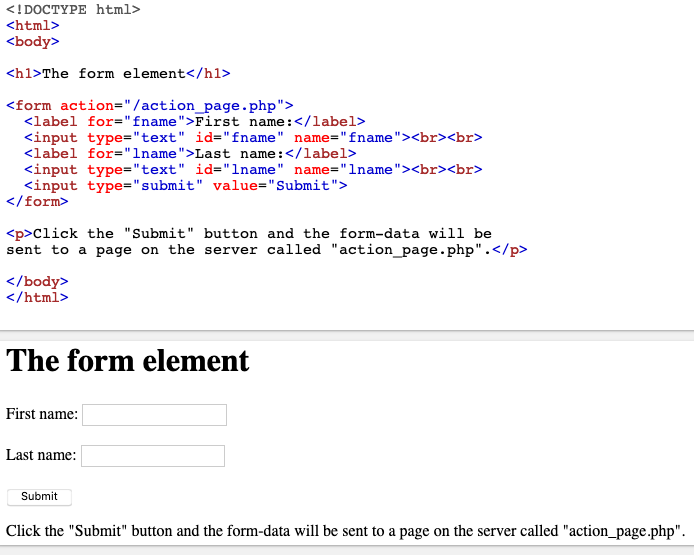
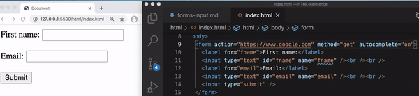

# Inputs & Forms

[form](#-form)  

## //////////////////////////////////////////////////////////// form

Is used to create an HTML form for user input.

**Alt:** Represents a document section containing interactive controls for submitting information.

## Example:

## Attributes:

<ins>**accept-charset**</ins>

Specifies the character encodings that are to be used for the form submission. Common values are:

- UTF-8 (Character encoding for Unicode)
- ISO-8859-1 (Character encoding for the Latin alphabet)

In theory, any character encoding can be used, but no browser understands all of them. The more widely a character encoding is used, the better the chance a browser will understand it.

<ins>**action**</ins>

Specifies where to send the form-data when a form is submitted. It Specifies

- _absolute_ URL - points to another web site (http://www.example.com/example.htm)
- _relative_ URL - points to a file within a web site (example.htm)

This attribute was already shown in the aforementioned example for the `form` element.

<ins>**autocomplete**</ins>

Indicates whether input elements can by default have their values automatically completed by the browser.

- _on_:

Default. The browser will automatically complete entries based on values that user has entered before

- _off_:

The user must enter a value into each field for every use. The browser does not automatically complete entries.

## Example Files:

[index.html 1st part](html/index.html)  

[To Top](#inputs--forms)

